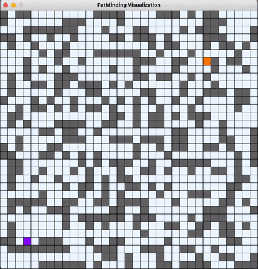

# PathFinding Visualization
## Visualize A* Search algorithm and Dijkstra's algorithm with pygame.

### How to get set up? ###

- Install ```Python 3```
- Install ```Pygame``` modules
- Run ````main.py```` file

### How to use:

- Left click to place blocks/walls
- Right click to delete blocks/walls

| Key  | Action |
| :---: | :---  |
| A  | Run A* Search Algorithm |
| D  | Run Dijkstra's Algorithm  |
| P  | Clear Paths |
| C  | Clear Board |


###Demo

#### A* Search Algorithm



#### Dijkstra's Algorithm


